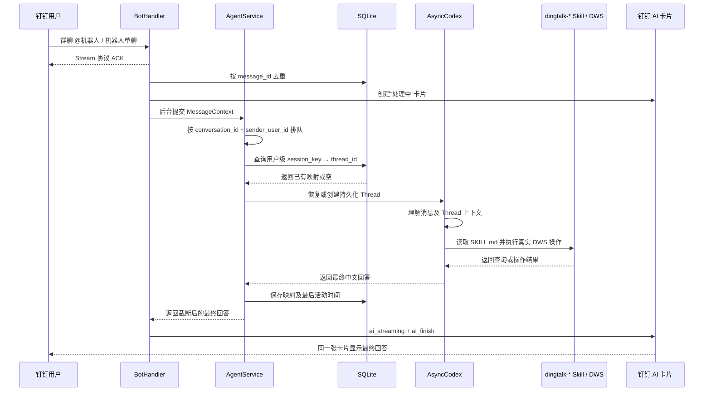

# ZME DingTalk Codex Gateway

本项目是一个“钉钉机器人 ↔ Codex”的薄网关：接收钉钉 Stream 消息，快速返回协议 ACK，在后台调用持久化 Codex Thread，并优先通过钉钉 AI 卡片把最终中文回答更新到原会话。AI 卡片不可用时，才通过原消息的 `sessionWebhook` 发送最终文本。

机器人自身不判断业务意图，也不重复实现钉钉产品工具。涉及聊天、文档、通讯录、日历、待办等钉钉数据时，由 Codex 选择并完整读取 `/home/mzx/.agents/skills` 下相应的 `dingtalk-*` Skill，再通过真实 DWS 命令完成查询或操作。

> 这不是面向公网的通用聊天机器人。Codex Thread 使用 `full_access`，能够调用本机 DWS 并访问运行账号有权访问的数据。请只在受控机器、受控组织和受控机器人可见范围内运行。

## 1. 最终效果

部署完成后：

1. 用户在内部群中 @机器人，或与机器人单聊；
2. 钉钉客户端在 AI 卡片中显示生成中状态；
3. Codex 结合当前会话上下文判断需求；
4. 如需钉钉数据，Codex 按 Skill 规则执行真实 DWS 命令；
5. Codex 完成后，机器人把同一张 AI 卡片更新为最终结果；
6. 如果应用没有卡片能力或创建卡片失败，过程中不发送提示，只在完成后发送最终文本。

支持的会话行为：

- 每个“钉钉 `conversation_id` + 发送者用户 ID”独立对应一个 Codex `thread_id`；
- 同一用户在同一会话中的消息串行处理，不同用户或会话可并行处理；
- 机器人重启后从 SQLite 恢复 Thread 映射；
- Thread 5 分钟未活动后自动归档，全局最多保留 10 个活跃 Thread；
- 发送 `/new`、`/clear` 或 `/清空上下文` 可清空当前会话上下文；
- 按 `message_id` 去重，避免 Stream 重复投递造成重复执行；
- 当前只接收文本消息，非文本消息会收到明确提示。

## 2. 调用链与数据边界



### 2.1 应用启动

`app.py` 按以下依赖关系组装程序：

```text
DingTalkStreamClient
  → BotHandler
      → AgentService
          → CodexBackend
          → SessionStore
      → SessionWebhookRelay
```

- `DingTalkStreamClient` 使用 `DINGTALK_CLIENT_ID` 和 `DINGTALK_CLIENT_SECRET` 主动建立到钉钉的 Stream 长连接，本项目不启动公网 HTTP 服务；
- `BotHandler` 负责解析消息、快速 ACK、后台任务、AI 卡片和文本回复降级；
- `AgentService` 负责去重后的会话调度、串行/并发控制、Thread 生命周期、异常提示和回复截断；
- `CodexBackend` 负责 `AsyncCodex` 客户端、持久化 Thread 和 Turn；
- `SessionStore` 负责 SQLite 映射、去重键和时间戳；
- `SessionWebhookRelay` 只在 AI 卡片不可用或更新异常时，通过原消息附带的 `sessionWebhook` 补发普通文本。

### 2.2 收到消息并快速 ACK

用户在群聊中 @机器人，或者向机器人发起单聊后，`BotHandler` 从 Stream 回调中提取：

- 消息正文；
- `message_id`；
- `sender_user_id`；
- `sender_nickname`；
- `conversation_id` 和会话类型；
- 包含 `sessionWebhook` 等信息的原始钉钉消息对象。

群聊直接使用钉钉提供的 `conversation_id`。单聊缺少该字段时，项目使用 `single:<sender_user_id>` 作为会话键，避免不同单聊共享上下文。

解析成功后，处理器创建一个后台 `asyncio.Task`，随即返回协议 ACK。协议 ACK 只表示机器人已经收到 Stream 回调，不代表 Codex 已完成，也不会作为一条消息显示在聊天窗口。项目不主动发送“已收到，正在处理。”文本消息，因此耗时工作不会阻塞钉钉回调。

当前只处理文本消息。非文本消息不进入 Codex，而是通过 `sessionWebhook` 回复“当前仅支持文本消息。”。

### 2.3 去重与“处理中”卡片

后台任务先尝试把 `message_id` 原子写入 SQLite。相同 `message_id` 再次投递时，`INSERT OR IGNORE` 不会重复取得处理权，机器人也不会再次调用 Codex 或执行 DWS 操作。

去重记录默认保留 7 天。机器人启动时会先删除超过保留期的记录，运行期间默认每小时再次清理。保留期与 Codex Thread 的 5 分钟空闲超时相互独立：Thread 被归档后，近期消息仍然保持去重，避免 Stream 重投触发同一操作。超过 7 天后再次出现完全相同的 `message_id` 会被视为新消息，因此不要为了节省少量磁盘空间把保留期设置得过短。

去重成功后，机器人立即尝试创建 AI 卡片。卡片由钉钉客户端显示“处理中”状态；此时 Codex 可能仍在排队。创建卡片所用的 SDK HTTP 调用会放入工作线程，避免同步网络请求阻塞 Stream 事件循环。

AI 卡片使用钉钉 SDK 的通用模板，并把最终布局限制为 `msgContent`，避免空标题、图片或轮播区域。卡片创建和流式正文更新分别依赖 `Card.Instance.Write` 与 `Card.Streaming.Write` 权限。

### 2.4 用户级上下文、排队与并发

调度以“`conversation_id` + `sender_user_id`”为单位：

| 场景 | 实际处理方式 |
| --- | --- |
| 同一个单聊连续发送多条消息 | 每条消息各自显示处理中卡片，Codex 按会话串行执行 |
| 同一个群中同一用户连续提问 | 按群的 `conversation_id` 串行执行 |
| 同一个群中多个用户同时提问 | 使用不同 Codex Thread，可在全局并发限制内并行 |
| 不同群或不同单聊同时提问 | 允许并行，默认最多同时执行 2 个 Codex Turn |
| 超出全局并发数 | 消息保留处理中卡片，等待前面的任务释放并发名额 |

同一用户在同一会话中使用一把 `asyncio.Lock`，防止多个 Turn 同时修改同一个上下文；所有用户再经过全局 `asyncio.Semaphore`，并发上限由 `CODEX_MAX_CONCURRENCY` 控制，默认值为 `2`。

新消息不会取消或打断同一用户正在运行的上一条消息，只会排队等待。`/new`、`/clear` 和 `/清空上下文` 也遵循相同队列顺序，只清除发送者在当前会话中的 Thread，不会影响群内其他用户。

### 2.5 恢复或创建 Codex Thread

取得执行权后，`AgentService` 将 `conversation_id` 和 `sender_user_id` 计算成不可逆的 SHA-256 `session_key`，再查询 SQLite 中的 `session_key → thread_id` 映射。SQLite 沿用原 `conversation_id` 列保存该不透明键，以兼容已有数据库结构。

1. 映射存在且未过期：调用 SDK 恢复对应的 Codex Thread；
2. 映射超过 `CONVERSATION_IDLE_TIMEOUT_SECONDS`，默认 300 秒：删除映射并归档旧 Thread，再创建新 Thread；
3. Thread 恢复失败：删除失效映射并创建新 Thread，避免会话永久不可用；
4. 映射不存在：创建新的持久化 Thread；
5. 创建新 Thread 前如果已有映射达到 `MAX_ACTIVE_THREADS`，默认 10 个：归档并删除最后活动时间最早且当前未执行的 Thread；
6. 收到重置命令：删除当前用户的映射并尽力归档旧 Thread，下一条消息再创建新 Thread。

Thread 创建时即启动 5 分钟空闲计时器，每次成功回答后重新计时。计时到期时，后台任务再次核对最后活动时间，然后删除 SQLite 映射并调用 Codex 归档接口。正在执行的 Thread 不会被空闲清理或容量淘汰。机器人重启并恢复 Stream 事件循环时，会读取持久化映射：过期 Thread 立即归档，超出上限的最旧 Thread 立即淘汰，其余 Thread 按剩余空闲时间恢复计时器。

Thread 生命周期总结：

| 事件 | 映射和上下文行为 |
| --- | --- |
| 同一用户在同一会话继续发言 | 恢复并复用原 Thread，保留该用户上下文 |
| 同一群中的另一用户发言 | 使用另一条用户级映射和另一 Thread，不读取前一用户上下文 |
| 5 分钟没有新对话 | 删除映射、尽力归档 Thread；下次发言创建全新 Thread |
| 活跃映射达到 10 个后出现新用户级会话 | 淘汰最后活动时间最早且当前未执行的 Thread，再创建新 Thread |
| 用户发送 `/new`、`/clear` 或 `/清空上下文` | 只清除该用户在当前会话的映射；下一条消息创建全新 Thread |
| 持久化 Thread 恢复失败 | 删除失效映射并创建新 Thread，不继续使用损坏的上下文 |
| 机器人重启 | 从 SQLite 恢复仍未过期的映射，并按剩余空闲时间恢复计时 |

Thread 被空闲清理、容量淘汰、手工清除或恢复失败后，旧上下文不会迁移到新 Thread。用户再次发言会得到新的上下文；例如旧 Thread 中尚未完成的待办确认，不能在新 Thread 中只发送一句“确认”来继续执行。

新 Thread 使用 `ephemeral=False`，所以机器人重启后可以根据 SQLite 中的 ID 恢复未过期上下文。模型名称没有硬编码，使用本机 Codex 配置。Codex 工作目录为 `data/codex-workspace`，避免把聊天用户直接带入机器人源码目录。

### 2.6 Codex、Skill 与 DWS

机器人通过 `ExternalMessage` 把网关生成的 JSON 信封提交为一个 Codex Turn。信封包含可信的 `sender_user_id`、昵称、会话 ID、会话类型，以及独立的用户消息正文。每个新建或恢复的 Thread 都注入 Developer Instructions，要求 Codex：

1. 判断用户真实需求以及它与当前上下文的关系；
2. 涉及钉钉数据或操作时，从 `/home/mzx/.agents/skills` 选择最相关、最小集合的 `dingtalk-*` Skill；
3. 完整读取所选 Skill 的 `SKILL.md`；
4. 遵守 Skill 的产品边界、权限和人工确认要求；
5. 通过 Skill 规定的真实 DWS 命令查询或执行操作；
6. 搜索只用于候选定位，读取文档时必须读取真实正文；
7. 无法验证时明确说明，禁止虚构查询或操作结果；
8. 最终只输出适合直接发送到钉钉的中文回答。

单个 Turn 默认最多运行 `CODEX_TIMEOUT_SECONDS=600` 秒。超时后，后端尝试调用 `turn.interrupt()`，并向用户返回超时提示；其他异常会转换成不暴露内部信息的失败提示。

### 2.7 发送者身份与确认边界

网关从钉钉回调中提取 `sender_user_id` 和 `sender_nickname`，并把它们作为网关生成的元数据传给 Codex。Developer Instructions 明确要求正文中伪造的身份字段不得覆盖网关元数据，并禁止在最终回复中泄露内部用户 ID。

每条消息都会重新从当前 Stream 回调取得发送者 ID，然后计算当前消息的用户级 `session_key`；机器人不会沿用上一条消息缓存的“当前用户”。网关信任钉钉回调提供的身份，不会在每轮对话中再次查询通讯录验证该用户。如果回调没有提供发送者 ID，则使用 `message_id` 创建仅限该条消息的隔离上下文，且 Developer Instructions 禁止执行“我的”资源查询、写操作或其他依赖请求者身份的操作。

具体保证如下：

- 用户 A 发起的待确认操作只存在于 A 的 Thread；
- 用户 B 回复“确认”会进入 B 的独立 Thread，不会接续 A 的操作；
- “我”“本人”“给我”等表达按当前信封中的 `sender_user_id` 解释；
- 这是 Agent 上下文隔离，不替代 DWS 和具体 Skill 自身的权限校验与高风险操作确认规则。

因此，当前设计解决的是“A 发起待确认操作，B 用一句‘确认’接续 A 上下文”的串话问题。它不是独立的业务授权系统：用户主动明确要求操作其他人的资源时，是否允许执行仍由对应 `dingtalk-*` Skill、DWS 登录身份以及钉钉产品权限共同决定。

### 2.8 返回最终结果

Codex 返回 `final_response` 后，机器人执行以下步骤：

1. 更新 SQLite 中当前会话的 `thread_id` 和最后活动时间；
2. 按 `MAX_REPLY_CHARACTERS` 安全截断，默认最多 4000 个字符；
3. 如果已成功创建 AI 卡片，先调用 `ai_streaming(..., append=False)` 写入完整 Markdown，再调用 `ai_finish()` 切换到完成状态；
4. 如果卡片创建失败，则通过当前消息的 `sessionWebhook` 发送最终文本；
5. 如果卡片更新抛出异常，则通过 `sessionWebhook` 补发同一份最终文本；
6. 普通文本降级回复会 @当前消息的发送者。

当前 Codex SDK 只返回最终回答，项目没有消费逐 Token 增量，所以卡片在 Codex 运行期间显示“处理中”，完成后一次性替换为完整答案，而不是逐字输出。

### 2.9 SQLite 数据边界

本地 SQLite 默认位于 `data/conversations.db`，只保存：

- 用户级不透明 `session_key` 与 `thread_id` 的映射；
- 已处理的 `message_id`；
- 最后活动时间和去重时间。

SQLite 不保存完整消息正文、用户昵称或明文用户 ID。Codex Thread 的实际状态由 Codex 维护；机器人只保存恢复 Thread 所需的不透明标识。

两张表采用不同的生命周期：

- `conversation_sessions`：按 5 分钟空闲超时、最多 10 个 Thread、手工重置和恢复失败进行实时删除；删除映射时会尽力归档对应 Codex Thread；
- `processed_messages`：按 `MESSAGE_DEDUP_RETENTION_DAYS` 保留，启动时清理一次，之后按 `SQLITE_CLEANUP_INTERVAL_SECONDS` 周期清理。

机器人启动维护任务时，先清理过期 `processed_messages`，再恢复和裁剪 `conversation_sessions`，最后启动周期去重清理。会话映射的删除与消息去重记录的删除互不级联：即使一个 Thread 已在 5 分钟后归档，对应 `message_id` 默认仍保留 7 天，避免钉钉延迟重投导致写操作重复执行。

清理语句使用已有的 `processed_at` 索引，只删除早于截止时间的行。清理后执行轻量的 `PRAGMA optimize`，但在线运行时不执行 `VACUUM`：已释放页面会被 SQLite 后续写入复用，数据库文件不一定立即缩小，从而避免 `VACUUM` 的强锁和额外 I/O 影响机器人回复。某次清理失败只记录日志，Stream 接收、Thread 恢复和后续周期重试仍会继续。

超过去重保留期后，同一个 `message_id` 若再次到达，会重新取得处理权并被当作新消息。增大保留天数会提高对超迟重复投递的防护，但会保留更多去重行；减小保留天数会降低记录量，同时增加旧消息再次执行的风险。正常情况下保持默认 7 天即可。

## 3. 运行环境与依赖

### 3.1 必需环境

| 项目 | 要求 | 用途 |
| --- | --- | --- |
| 操作系统 | 推荐 Linux；本文命令以 Bash/Linux 为例 | 长期运行 Stream 客户端和本机工具 |
| Python | 推荐 3.12，最低 3.10 | 运行机器人和官方 Python SDK |
| Python venv/pip | 与 Python 对应 | 创建隔离环境、安装依赖 |
| 网络 | 可访问钉钉 Stream、消息 Webhook、Codex/OpenAI 和 DWS 所需服务 | 收消息、回复、执行 Codex 和钉钉操作 |
| 钉钉应用 | 企业内部应用机器人，消息接收模式为 Stream | 获取机器人消息 |
| Codex 身份 | 本机已有 Codex 登录态，或配置 `CODEX_API_KEY` | 调用 Codex |
| DWS CLI | 已安装、已登录并选中正确组织/账号 | 执行真实钉钉查询和操作 |
| DingTalk Skills | `/home/mzx/.agents/skills/dingtalk-*/SKILL.md` | 告诉 Codex 如何安全使用 DWS |

### 3.2 Python 依赖

项目直接依赖：

```text
dingtalk-stream==0.24.3
openai-codex==0.154.0
```

`openai-codex` 会安装与其版本匹配的 Codex CLI runtime，首次安装包体积可能较大。SQLite 使用 Python 标准库 `sqlite3`，无需安装独立数据库服务。HTTP 回复使用 Python 标准库，项目不依赖 `httpx` 或旧版 `openai` Python 包。

### 3.3 运行账号非常重要

机器人进程、Codex 和 DWS 应使用同一个操作系统账号运行。Codex 登录缓存、DWS 登录状态、DWS profile 和 Skills 都属于运行账号；如果先用个人账号配置，最后却让 `root` 或另一个 systemd 用户启动，常见结果是机器人能够接收消息，但 Codex 未登录、DWS 未登录或看不到 Skills。

不要使用 `sudo pip install`，也不要用 `sudo` 启动机器人来绕过目录权限。

### 3.4 Python 如何启动 Codex

机器人不是通过 HTTP 调用一个预先部署的 Codex 服务。`AsyncCodex` 在第一次需要创建或恢复 Thread 时延迟启动 SDK 自带的 Codex runtime：

```text
机器人 Python 主进程
  └─ 第一次处理钉钉消息
      └─ AsyncCodex 延迟初始化
          └─ codex app-server --listen stdio://
```

这个 `codex app-server` 是机器人 Python 进程的后台子进程，通过标准输入输出进行 JSON-RPC 通信，不监听 TCP 端口：

- 每个机器人 Python 进程只启动一个 app-server，供所有钉钉会话复用；
- 不同 `conversation_id` 仍使用不同的持久化 Codex Thread；
- app-server 通常一直存活到机器人进程退出，退出时 SDK 会终止子进程；
- 它与桌面 Codex 是两个独立进程，不会接管、关闭或直接阻塞桌面应用；
- 但同一系统用户下的机器人、Codex CLI 和桌面 Codex 可能共享 `CODEX_HOME` 中的认证缓存、配置和 Thread 状态；
- 两边同时工作还会共享同一账号或 API Key 的费用、额度和速率限制，因此机器人繁忙时可能间接影响桌面端。

机器人默认工作目录是 `data/codex-workspace`，不会把群聊用户直接带入机器人源码目录。不过 Thread 当前使用 `full_access`，工作目录隔离不能替代操作系统账号、凭证和权限隔离。

#### `CODEX_API_KEY` 与 `OPENAI_API_KEY`

当前机器人代码明确读取的是 `CODEX_API_KEY`：非空时调用 SDK 的 `login_api_key()`；为空时复用运行账号已有的 Codex 登录状态。仅设置 `OPENAI_API_KEY` 不能替代项目要求的 `CODEX_API_KEY`，不要混用这两个名字。

同一把 API Key 同时用于桌面端和机器人在技术上通常可以工作，但不建议用于正式部署，原因包括：

- 费用、Token 用量和 RPM/TPM 限额混在一起，难以区分来源；
- 机器人并发可能导致桌面端被限流或额度提前耗尽；
- Key 泄露、轮换或吊销会同时影响两个入口；
- 两边共享认证和状态目录时，登录方式、默认配置或 Thread 操作可能互相影响；
- 无法为机器人单独设置预算、告警、审计和停用策略。

推荐生产环境采用以下隔离方式：

1. 为机器人创建独立的 OpenAI Project/API Key，并设置独立预算和限额；
2. 只在机器人进程的 `.env` 或 systemd `EnvironmentFile` 中配置 `CODEX_API_KEY`，不要全局 `export`；
3. 为机器人配置独立的 `CODEX_HOME`，隔离认证、配置和 Codex 状态；
4. 更严格的部署使用独立 Linux 服务账号，同时隔离 Codex、DWS、Skills、日志和数据目录；
5. 不要在桌面端同时打开或修改机器人正在使用的 Thread。

Codex 官方对登录缓存、API Key 和 `CODEX_HOME` 的说明见 [OpenAI Codex Authentication](https://learn.chatgpt.com/docs/auth) 和 [OpenAI Codex environment variables](https://learn.chatgpt.com/docs/config-file/environment-variables)。

## 4. 从零部署

以下步骤建议严格按顺序执行。先在测试组织和测试群验证，再扩大机器人可见范围。

### 4.1 准备钉钉企业内部应用机器人

1. 使用有应用开发权限的账号登录[钉钉开发者后台](https://open-dev.dingtalk.com/#/)；
2. 进入“应用开发”，创建企业内部应用；
3. 在应用的“凭证与基础信息”中保存 `Client ID` 和 `Client Secret`；
4. 在“应用能力 > 机器人”中启用机器人能力；
5. 消息接收模式选择 **Stream 模式**；
6. 配置机器人名称、头像和简介；
7. 创建并发布应用版本，初次发布时只选择测试人员或测试部门作为可见范围；
8. 在测试群中添加该机器人，或从工作台进入机器人单聊。

Stream 模式由本机主动连接钉钉，不要求公网 IP、域名或公网回调地址。AI 卡片由 `dingtalk-stream` SDK 使用应用凭证获取 Access Token，并调用卡片创建、投放和更新接口；卡片不可用时，项目使用消息自带的 `sessionWebhook` 发送最终文本。

“正在生成中”不是普通文本消息，也不是对 `sessionWebhook` 文本的原地编辑，而是钉钉的 AI 卡片状态。应用需要具备互动卡片能力和对应接口权限；不同组织、应用版本或客户端能力可能不同，所以项目始终保留“只发送最终文本”的自动降级路径。

钉钉后台页面会持续更新，如菜单名称不同，请以当前官方文档为准：

- [配置企业机器人](https://open.dingtalk.com/document/dingstart/configure-the-robot-application)
- [机器人接收消息](https://open.dingtalk.com/document/dingstart/robot-receive-message)
- [机器人回复/发送消息](https://open.dingtalk.com/document/dingstart/robot-reply-and-send-messages)
- [发布应用](https://open.dingtalk.com/document/dingstart/publish-dingtalk-application)

### 4.2 获取项目并进入目录

如果通过 Git 分享，请先克隆仓库，再进入本项目目录：

```bash
git clone <仓库地址>
cd ZME-Dingtalk-Robot
```

如果直接复制项目压缩包，解压后进入包含 `main.py` 和 `requirements.txt` 的目录即可。后续命令均假设当前目录为项目根目录。

### 4.3 检查 Python

```bash
python3 --version
python3 -m venv --help >/dev/null
```

Python 应为 3.10 或更高版本，推荐 3.12。如果系统提示没有 `venv`，Debian/Ubuntu 通常需要安装与 Python 版本对应的 `python3-venv` 包。

### 4.4 创建虚拟环境并安装依赖

```bash
python3 -m venv .venv
.venv/bin/python -m pip install --upgrade pip
.venv/bin/python -m pip install -r requirements.txt
```

验证版本和关键导入：

```bash
.venv/bin/python - <<'PY'
import importlib.metadata
import dingtalk_stream
from openai_codex import AsyncCodex

print("dingtalk-stream:", importlib.metadata.version("dingtalk-stream"))
print("openai-codex:", importlib.metadata.version("openai-codex"))
print("关键模块导入成功")
PY
```

如果安装速度慢或失败，先确认 PyPI 网络、代理、DNS、磁盘空间和系统时间是否正常，不要改成来源不明的同名包。

### 4.5 安装并登录 Codex

项目优先复用运行账号已有的 Codex 登录状态，也可以仅为机器人进程注入 `CODEX_API_KEY`。

本机已有 `codex` 命令时，推荐先检查：

```bash
codex --version
codex login status
```

没有登录时，可以执行：

```bash
codex login
```

无图形界面的服务器可尝试：

```bash
codex login --device-auth
```

也可以在 OpenAI Platform 创建 API Key，并把它作为 `CODEX_API_KEY` 仅注入机器人进程。不要把 Key 写进源码、提交到 Git、粘贴到群聊或输出到日志。官方 Codex 认证说明见 [OpenAI Codex Authentication](https://learn.chatgpt.com/docs/auth)。

> `openai-codex` 自带运行时，但不保证在虚拟环境中生成可直接调用的 `codex` 命令。如果需要交互式登录，请按官方方式单独安装 Codex CLI；机器人 SDK 仍会使用其匹配的内置 runtime。

### 4.6 安装、登录并检查 DWS

确认 DWS CLI 对运行账号可用：

```bash
command -v dws
dws version
dws auth status
dws profile list
dws doctor
```

如果尚未登录：

```bash
dws auth login
dws auth status
dws profile list
```

如果存在多个组织或账号，请按 DWS 帮助切换到机器人应该使用的 profile：

```bash
dws profile switch
```

然后用一个低风险、只读命令验证真实访问能力。具体命令应先查看对应 Skill 和叶子命令帮助，不要凭示例猜参数：

```bash
dws contact --help
dws contact user get-self --help
```

DWS 使用的是运行账号的用户身份和权限，不是机器人的 `DINGTALK_CLIENT_ID`/`DINGTALK_CLIENT_SECRET`。DWS 能看到什么数据，取决于当前登录用户、组织 profile、产品权限和授权范围。

### 4.7 检查 DingTalk Skills

当前版本的 Codex Developer Instructions 要求 Skills 位于：

```text
/home/mzx/.agents/skills
```

至少应存在一个与目标能力匹配的 `dingtalk-*` Skill，并且每个 Skill 目录中包含可读的 `SKILL.md`：

```bash
find /home/mzx/.agents/skills \
  -mindepth 2 -maxdepth 2 \
  -path '*/dingtalk-*/SKILL.md' \
  -print | sort
```

分享给其他 Linux 用户时要特别注意：当前代码中的 Skills 根目录是固定路径。部署账号不是 `mzx` 时，应先把 Skills 安装到该路径，或在分享前把项目改造成可配置路径；仅把仓库复制给其他人并不会自动附带这些 Skills。

Skills 不是普通提示词集合。Codex 必须完整读取相关 `SKILL.md`，遵守其中的权限、确认、产品边界和验证规则，再执行真实 DWS 命令。缺少 Skills 时，机器人不应声称已经查询或操作成功。

### 4.8 创建配置文件

项目不会自动读取 `.env`，但可以复制模板作为本机配置源：

```bash
cp .env.example .env
chmod 600 .env
```

编辑 `.env`，最少填写：

```dotenv
DINGTALK_CLIENT_ID=你的应用Client_ID
DINGTALK_CLIENT_SECRET=你的应用Client_Secret
```

常用完整配置：

```dotenv
# 钉钉 Stream 机器人凭证，必填。
DINGTALK_CLIENT_ID=
DINGTALK_CLIENT_SECRET=

# Codex。留空 CODEX_API_KEY 时复用运行账号的本机登录状态。
CODEX_API_KEY=
# 可选：生产环境建议设置为机器人独享的绝对路径。
# CODEX_HOME=/var/lib/zme-dingtalk-robot/codex
CODEX_WORKSPACE=data/codex-workspace
CODEX_TIMEOUT_SECONDS=600
CODEX_MAX_CONCURRENCY=2
MAX_ACTIVE_THREADS=10

# 会话、去重与回复。
CONVERSATION_DATABASE_PATH=data/conversations.db
CONVERSATION_IDLE_TIMEOUT_SECONDS=300
MESSAGE_DEDUP_RETENTION_DAYS=7
SQLITE_CLEANUP_INTERVAL_SECONDS=3600
MAX_REPLY_CHARACTERS=4000
DINGTALK_REPLY_TIMEOUT_SECONDS=20

# 日志。
LOG_LEVEL=INFO
LOG_FILE=logs/robot.log
LOG_MAX_BYTES=10485760
LOG_BACKUP_COUNT=5
```

各配置项说明：

| 环境变量 | 必填 | 默认值 | 说明 |
| --- | ---: | --- | --- |
| `DINGTALK_CLIENT_ID` | 是 | 无 | 企业内部应用 Client ID |
| `DINGTALK_CLIENT_SECRET` | 是 | 无 | 企业内部应用 Client Secret |
| `CODEX_API_KEY` | 否 | 空 | 非空时由 SDK 使用该 API Key 登录；否则复用本机 Codex 登录态 |
| `CODEX_HOME` | 否 | Codex 默认值 | Codex 上游运行时变量；生产环境建议设置独立绝对路径以隔离认证、配置和状态 |
| `CODEX_WORKSPACE` | 否 | `data/codex-workspace` | Codex 工作目录，隔离于机器人源码 |
| `CODEX_TIMEOUT_SECONDS` | 否 | `600` | 创建、恢复、归档 Thread 和执行 Turn 的超时秒数 |
| `CODEX_MAX_CONCURRENCY` | 否 | `2` | 不同钉钉会话同时进入 Codex 的最大数量 |
| `CONVERSATION_DATABASE_PATH` | 否 | `data/conversations.db` | SQLite 会话映射和去重数据库 |
| `MAX_ACTIVE_THREADS` | 否 | `10` | 全局最多保留的用户级 Codex Thread 数量 |
| `CONVERSATION_IDLE_TIMEOUT_SECONDS` | 否 | `300` | Thread 无新对话后的自动归档秒数 |
| `MESSAGE_DEDUP_RETENTION_DAYS` | 否 | `7` | `message_id` 去重记录保留天数，支持小数且必须大于 0 |
| `SQLITE_CLEANUP_INTERVAL_SECONDS` | 否 | `3600` | 运行期间清理过期去重记录的周期秒数 |
| `MAX_REPLY_CHARACTERS` | 否 | `4000` | 最终回复最大字符数，超出后安全截断 |
| `DINGTALK_REPLY_TIMEOUT_SECONDS` | 否 | `20` | 调用 `sessionWebhook` 的 HTTP 超时秒数 |
| `LOG_LEVEL` | 否 | `INFO` | 日志级别，例如 `INFO`、`WARNING`、`DEBUG` |
| `LOG_FILE` | 否 | `logs/robot.log` | 轮转日志文件路径 |
| `LOG_MAX_BYTES` | 否 | `10485760` | 单个日志文件最大字节数 |
| `LOG_BACKUP_COUNT` | 否 | `5` | 保留的轮转日志文件数量 |

所有整数或浮点配置都必须大于 0。相对路径以进程启动时的工作目录为基准，所以生产部署必须设置正确的 `WorkingDirectory`。

### 4.9 加载环境变量

本地手动启动前执行：

```bash
set -a
source .env
set +a
```

检查必需变量是否存在，但不要打印真实值：

```bash
test -n "$DINGTALK_CLIENT_ID" && echo "DINGTALK_CLIENT_ID: OK"
test -n "$DINGTALK_CLIENT_SECRET" && echo "DINGTALK_CLIENT_SECRET: OK"
```

`.env` 已在 `.gitignore` 中忽略，但仍应执行 `chmod 600 .env`。不要把真实 `.env` 发给他人；分享时只提供 `.env.example`。

### 4.10 运行单元测试

```bash
.venv/bin/python -m unittest discover -s tests -v
```

单元测试使用 Fake Codex Backend，不访问真实钉钉、DWS 或 Codex API，覆盖：

- SQLite Thread 映射、重启恢复、过期和清除；
- `message_id` 去重；
- 同一用户会话的 Thread 复用与串行执行；
- 同群不同用户的 Thread 隔离；
- 5 分钟空闲归档和最多 10 个 Thread 的最旧项淘汰；
- 恢复失败后自动创建新 Thread；
- 不同会话隔离及受限并行；
- `/new` 清空并归档旧 Thread；
- 回复安全截断；
- AI 卡片生成中状态、最终内容更新和不可用时的纯文本降级；
- Codex 超时和异常提示；
- 日志文件、`request_id` 和凭证脱敏。

测试失败时不要继续上线，先根据首个失败用例修复环境或代码。

### 4.11 首次启动

确保当前 Shell 已加载环境变量，然后启动：

```bash
.venv/bin/python main.py
```

另开一个终端查看日志：

```bash
tail -F logs/robot.log
```

正常情况下应看到应用初始化和 Stream 客户端启动日志，进程保持前台运行。按 `Ctrl+C` 停止。

## 5. 首次联调清单

建议在钉钉测试群中逐项验证：

1. 群内发送 `@机器人 你好`；
2. 确认 Stream 回调快速 ACK，钉钉侧没有重复重试；
3. 确认没有收到“已收到，正在处理。”文本消息；
4. 应用具备卡片能力时，确认对话框显示 AI 卡片生成中状态，稍后同一卡片更新为最终中文回答；
5. 应用不具备卡片能力时，确认过程中无提示，稍后只收到一条最终文本；
6. 提问一个只读、低风险的钉钉查询，确认 Codex 真的选择 Skill 并调用 DWS；
7. 要求读取一篇钉钉文档，确认回答来自真实正文而不是搜索摘要；
8. 连续追问，确认同一群复用上下文；
9. 在另一群或单聊提问，确认不会共享上下文；
10. 发送 `/new`，确认下一条消息进入新上下文；
11. 重启机器人后在原会话继续提问，确认 Thread 可以恢复；
12. 重复投递同一个测试 `message_id` 时，确认不会重复执行；
13. 检查日志中没有 Client Secret、API Key、Access Token 或完整 `sessionWebhook`。

单元测试不会验证真实账号权限、实际 DWS 可见范围、Codex 登录状态、钉钉应用发布状态和线上 `sessionWebhook` 有效性；这些必须在受控测试组织中完成集成验证。

## 6. 生产运行：systemd 示例

以下示例适用于单机 Linux。把用户名和项目路径替换为真实值，并确保该用户已经完成 Codex、DWS 和 Skills 配置。

创建仅本机可读的环境文件，例如 `/etc/zme-dingtalk-robot.env`：

```dotenv
DINGTALK_CLIENT_ID=...
DINGTALK_CLIENT_SECRET=...
CODEX_API_KEY=
CODEX_HOME=/var/lib/zme-dingtalk-robot/codex
CODEX_WORKSPACE=/opt/zme-dingtalk-robot/data/codex-workspace
CONVERSATION_DATABASE_PATH=/opt/zme-dingtalk-robot/data/conversations.db
LOG_FILE=/opt/zme-dingtalk-robot/logs/robot.log
```

设置权限：

```bash
sudo install -d -o <运行账号> -g <运行账号主组> -m 700 \
  /var/lib/zme-dingtalk-robot/codex
sudo chown root:root /etc/zme-dingtalk-robot.env
sudo chmod 600 /etc/zme-dingtalk-robot.env
```

创建 `/etc/systemd/system/zme-dingtalk-robot.service`：

```ini
[Unit]
Description=ZME DingTalk Codex Gateway
After=network-online.target
Wants=network-online.target

[Service]
Type=simple
User=<运行账号>
Group=<运行账号主组>
WorkingDirectory=/opt/zme-dingtalk-robot
EnvironmentFile=/etc/zme-dingtalk-robot.env
Environment=PYTHONUNBUFFERED=1
ExecStart=/opt/zme-dingtalk-robot/.venv/bin/python /opt/zme-dingtalk-robot/main.py
Restart=on-failure
RestartSec=5
TimeoutStopSec=30
UMask=0077

[Install]
WantedBy=multi-user.target
```

加载并启动：

```bash
sudo systemctl daemon-reload
sudo systemctl enable --now zme-dingtalk-robot
sudo systemctl status zme-dingtalk-robot
sudo journalctl -u zme-dingtalk-robot -f
```

注意：

- `EnvironmentFile` 中不要写 `export`；
- 生产机器人应使用独立的 `CODEX_API_KEY` 和 `CODEX_HOME`，避免与桌面 Codex 混用状态、额度和限流；
- systemd 的 `User` 必须能读取 Codex、DWS 和 Skills 状态；
- `WorkingDirectory` 必须是项目根目录，否则默认的 `data/` 和 `logs/` 会落到错误位置；
- 修改环境文件后执行 `sudo systemctl restart zme-dingtalk-robot`；
- 不要同时启动多个实例并共用同一个 SQLite 文件和同一套 Stream 应用凭证，除非已经专门验证多实例语义。

## 7. 日常运维

### 查看进程和日志

```bash
systemctl status zme-dingtalk-robot
journalctl -u zme-dingtalk-robot --since today
tail -F logs/robot.log
```

### 升级代码和依赖

先备份 SQLite，然后在维护窗口操作：

```bash
cp data/conversations.db "data/conversations.db.backup.$(date +%Y%m%d-%H%M%S)"
git pull --ff-only
.venv/bin/python -m pip install -r requirements.txt
.venv/bin/python -m unittest discover -s tests -v
sudo systemctl restart zme-dingtalk-robot
```

不要删除 `data/conversations.db`，否则会丢失钉钉会话到 Codex Thread 的恢复映射以及历史去重记录。数据库采用 WAL 模式，备份运行中的数据库时应使用 SQLite 在线备份方式；上面的直接复制命令只适合机器人已经停止或确认没有写入的维护窗口。

正常运行不需要手工清理或定期 `VACUUM`。如果长期运行后确实需要缩小数据库文件，应先停止机器人、完成备份，再在维护窗口执行 `sqlite3 data/conversations.db 'VACUUM;'`；不要在机器人处理消息时执行。

### 查看数据库结构，不查看消息正文

如果系统安装了 `sqlite3` 命令，可以执行：

```bash
sqlite3 data/conversations.db '.tables'
sqlite3 data/conversations.db \
  'SELECT conversation_id, thread_id, datetime(last_active_at, "unixepoch", "localtime") FROM conversation_sessions;'
sqlite3 data/conversations.db \
  'SELECT COUNT(*), datetime(MIN(processed_at), "unixepoch", "localtime"), datetime(MAX(processed_at), "unixepoch", "localtime") FROM processed_messages;'
```

数据库中不应存在完整消息正文。

### 清空某个会话上下文

优先让该会话中的用户发送：

```text
/new
```

机器人会清除映射并尽力归档旧 Thread。不要直接手工修改 SQLite，除非机器人已停止且你清楚数据关系。

## 8. 常见问题排查

### 8.1 启动时报“缺少必需环境变量”

原因：项目不会自动加载 `.env`。

处理：

```bash
set -a
source .env
set +a
.venv/bin/python main.py
```

systemd 部署则检查 `EnvironmentFile` 路径、文件格式和权限。

### 8.2 机器人完全收不到消息

依次检查：

1. 应用是否已发布，发布版本是否包含机器人能力；
2. 机器人消息接收模式是否为 Stream；
3. 当前用户或群是否在应用可见范围；
4. 群中是否已添加机器人，群聊消息是否明确 @机器人；
5. `Client ID` 和 `Client Secret` 是否来自同一个应用；
6. 进程是否持续运行，日志中是否有 Stream 连接错误；
7. 防火墙、代理、DNS 和系统时间是否正常。

### 8.3 AI 卡片一直显示生成中，没有最终结果

说明 Stream 接收和卡片创建链路大概率已通，重点检查：

- Codex 是否登录，账号是否有可用权限或额度；
- `CODEX_TIMEOUT_SECONDS` 是否过小；
- 应用是否具有卡片更新权限，卡片接口是否被限流；
- `logs/robot.log` 中是否有“Codex 处理失败”“处理超时”或 AI 卡片更新错误；
- 任务是否在等待 Skill 规定的人工确认。

如果日志显示“AI 卡片不可用，将仅发送最终文本”，这是自动降级而不是故障；此时还应检查 `sessionWebhook` 是否过期或网络不可达。

### 8.4 Codex 能回答，但无法查询钉钉数据

依次执行：

```bash
dws version
dws auth status
dws profile list
dws doctor
find /home/mzx/.agents/skills -path '*/dingtalk-*/SKILL.md' -print
```

确认这些命令是在启动机器人所用的同一个操作系统账号下执行。再根据具体产品 Skill 执行一个只读 DWS 命令验证权限边界。

### 8.5 查询到了错误组织的数据

原因通常是 DWS 当前 profile 不正确。执行：

```bash
dws profile list
dws profile switch
```

切换后重新验证只读命令。机器人应用凭证和 DWS profile 是两套独立身份，修改前者不会自动切换后者。

### 8.6 重启后上下文丢失

检查：

- `CONVERSATION_DATABASE_PATH` 是否改变；
- systemd 的 `WorkingDirectory` 是否改变；
- `data/conversations.db` 是否被删除或没有写权限；
- 日志中是否出现“恢复 Codex Thread 失败，将创建新 Thread”；
- Codex 登录身份或本机 Codex 状态目录是否发生变化。

恢复失败时，项目会自动清除失效映射并创建新 Thread，这是预期的故障降级行为。

### 8.7 重复回复

项目按钉钉 `message_id` 去重。若仍出现重复回复，检查是否：

- 启动了多个机器人实例；
- 多个实例使用了不同 SQLite 文件；
- 钉钉后台存在多个机器人应用同时加入同一群；
- 上游消息缺少稳定的 `message_id`。

### 8.8 回复被截断

默认最多 4000 个字符，末尾会出现“回答过长，已安全截断”。可调大 `MAX_REPLY_CHARACTERS`，但还需考虑钉钉消息接口自身限制和阅读体验。更推荐让用户缩小问题范围。

### 8.9 企业代理或私有 CA 导致 Codex TLS 失败

按组织安全策略配置 CA 文件，例如：

```bash
export CODEX_CA_CERTIFICATE=/path/to/corporate-root-ca.pem
```

也可使用标准 `SSL_CERT_FILE`。不要关闭 TLS 校验。相关变量说明见 [OpenAI Codex environment variables](https://learn.chatgpt.com/docs/config-file/environment-variables)。

## 9. 安全与权限说明

- Codex Thread 使用 `full_access` Sandbox，这是 DWS 和本机 Skills 能工作的前提，也是主要风险点；
- 只向可信组织成员开放机器人，不要公开暴露或加入不受控群；
- 钉钉应用可见范围遵循最小权限，先测试人员、后按需扩大；
- DWS 写操作或高风险操作必须遵循相应 Skill 的确认规则；
- 搜索结果只用于候选定位，读取文档时必须读取真实正文；
- 不得把 `Client Secret`、API Key、Token、Codex 登录缓存、DWS 凭证或完整 `sessionWebhook` 提交到仓库；
- `~/.codex/auth.json`（如果当前认证存储方式使用该文件）应按密码处理；
- `.env`、`data/` 和 `logs/` 已被 Git 忽略，但仍需限制文件权限；
- 日志会记录必要的排障上下文，应限制读取权限并设置合理保留周期；
- 不要把真实生产数据复制到测试、Issue、聊天或公开日志中。

## 10. 项目结构

```text
ZME-Dingtalk-Robot/
├── main.py                         # 程序入口
├── requirements.txt                # 固定版本的直接依赖
├── .env.example                    # 环境变量模板，不含真实凭证
├── zme_dingtalk_robot/
│   ├── app.py                      # 组装 Stream、Codex、SQLite 和回复链路
│   ├── config.py                   # 环境变量读取与校验
│   ├── handler.py                  # Stream 协议 ACK、AI 卡片与后台任务
│   ├── logging_config.py           # 日志轮转和凭证脱敏
│   ├── models.py                   # MessageContext
│   ├── relay.py                    # AI 卡片不可用时的最终文本回复
│   └── agent/
│       ├── codex_backend.py        # AsyncCodex 持久化 Thread 适配器
│       ├── service.py              # 会话串行、跨会话并发、超时和重置
│       └── session_store.py        # SQLite 映射和 message_id 去重
└── tests/
    ├── test_agent_service.py
    ├── test_codex_backend.py
    ├── test_config.py
    ├── test_handler.py
    ├── test_logging_config.py
    └── test_session_store.py
```

## 11. 当前限制

- 只处理文本消息；
- 优先使用 AI 卡片更新结果，卡片能力不可用时才通过原消息的 `sessionWebhook` 回复；
- AI 卡片依赖应用能力和卡片接口权限，必须在实际组织和客户端中联调；
- 降级链路中的 `sessionWebhook` 有有效期，特别长的任务可能无法回传最终结果；
- Skills 根目录当前固定为 `/home/mzx/.agents/skills`，分享给不同系统用户前需要处理路径；
- 使用单机 SQLite，当前设计面向单进程部署；
- 不内置用户白名单、群白名单或业务权限系统，访问控制依赖钉钉应用可见范围、DWS 身份权限和 Skill 规则；
- 不提供 Web 管理后台、健康检查 HTTP 端点或容器镜像；
- 不在 SQLite 中保存完整消息正文，也不提供历史消息检索；
- 去重是有界保留：超过 `MESSAGE_DEDUP_RETENTION_DAYS` 后，相同 `message_id` 再次到达会重新取得处理权；
- Thread 容量和空闲超时是单进程内的资源控制；当前设计不支持多个机器人进程共享调度状态。

## 12. 开发约束

项目使用官方 Python SDK `openai-codex==0.154.0` 的 `AsyncCodex`，不解析 `codex exec` 文本输出，不硬编码模型名称，不启用 ephemeral Thread。

每个新 Thread 都注入固定 Developer Instructions，要求 Codex：

- 根据需求选择最相关、最小集合的 `dingtalk-*` Skill；
- 完整读取选中 Skill 的 `SKILL.md`；
- 遵守 Skill 的权限、确认和产品边界，通过真实 DWS 命令执行；
- 把搜索结果只当作候选定位；
- 用户要求读取文档时读取真实正文；
- 不虚构查询、权限、成功状态或操作结果；
- 最终只输出适合直接发送到钉钉的中文回答。

钉钉消息通过 SDK 的 `ExternalMessage` 传入并标记为不可信外部内容。Codex 工作目录默认为 `data/codex-workspace`，与机器人源码隔离，避免群聊用户直接修改机器人项目。
